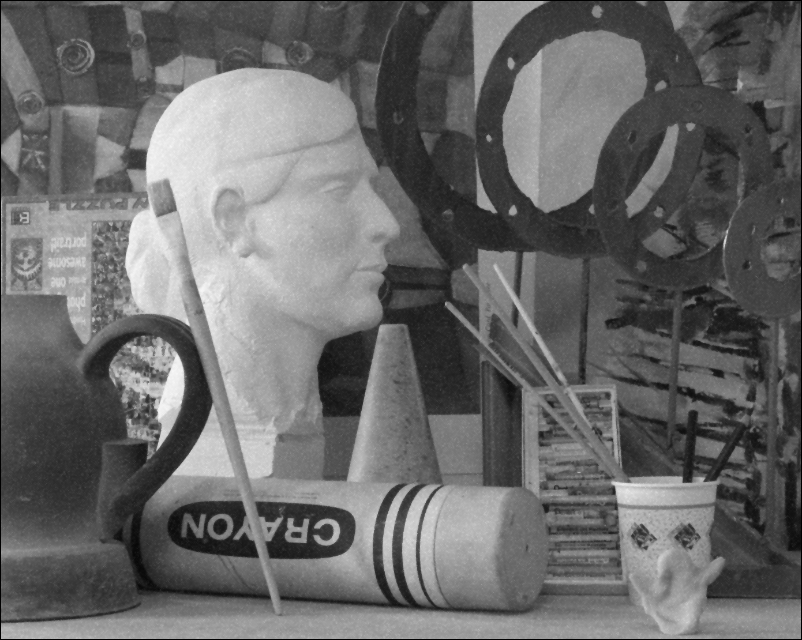

# Bilateral Filtering

## window size = 5

### spatial sigma = 1

spectral sigma = 3 | spectral sigma = 7
:-: | :-:
  | 

spectral sigma = 9 | spectral sigma =  11
:-: | :-:
  | 

### spatial sigma = 3

spectral sigma = 3| spectral sigma = 7
:-: | :-:
  | 

spectral sigma = 9 | spectral sigma =  11
:-: | :-:
  | 

### spatial sigma = 5

spectral sigma = 3| spectral sigma = 7
:-: | :-:
  | 

spectral sigma = 9 | spectral sigma =  11
:-: | :-:
  | 

### spatial sigma = 7

spectral sigma = 3| spectral sigma = 7
:-: | :-:
  | 

spectral sigma = 9 | spectral sigma =  11
:-: | :-:
  | 

## window size = 9

### spatial sigma = 1

spectral sigma = 3 | spectral sigma = 7
:-: | :-:
  | 

spectral sigma = 9 | spectral sigma =  11
:-: | :-:
  | 

### spatial sigma = 3

spectral sigma = 3| spectral sigma = 7
:-: | :-:
  | 

spectral sigma = 9 | spectral sigma =  11
:-: | :-:
  | 

### spatial sigma = 5

spectral sigma = 3| spectral sigma = 7
:-: | :-:
  | 

spectral sigma = 9 | spectral sigma =  11
:-: | :-:
  | 

### spatial sigma = 7

spectral sigma = 3| spectral sigma = 7
:-: | :-:
  | 

spectral sigma = 9 | spectral sigma =  11
:-: | :-:
  | 

## window size = 13

### spatial sigma = 1

spectral sigma = 3 | spectral sigma = 7
:-: | :-:
  | 

spectral sigma = 9 | spectral sigma =  11
:-: | :-:
  | 

### spatial sigma = 3

spectral sigma = 3| spectral sigma = 7
:-: | :-:
  | 

spectral sigma = 9 | spectral sigma =  11
:-: | :-:
  | 

### spatial sigma = 5

spectral sigma = 3| spectral sigma = 7
:-: | :-:
  | 

spectral sigma = 9 | spectral sigma =  11
:-: | :-:
  | 

### spatial sigma = 7

spectral sigma = 3| spectral sigma = 7
:-: | :-:
  | 

spectral sigma = 9 | spectral sigma =  11
:-: | :-:
  | 

## window size = 15

### spatial sigma = 1

spectral sigma = 3 | spectral sigma = 7
:-: | :-:
  | 

spectral sigma = 9 | spectral sigma =  11
:-: | :-:
  | 

### spatial sigma = 3

spectral sigma = 3| spectral sigma = 7
:-: | :-:
  | 

spectral sigma = 9 | spectral sigma =  11
:-: | :-:
  | 

### spatial sigma = 5

spectral sigma = 3| spectral sigma = 7
:-: | :-:
  | 

spectral sigma = 9 | spectral sigma =  11
:-: | :-:
  | 

### spatial sigma = 7

spectral sigma = 3| spectral sigma = 7
:-: | :-:
  | 

spectral sigma = 9 | spectral sigma =  11
:-: | :-:
  | 
